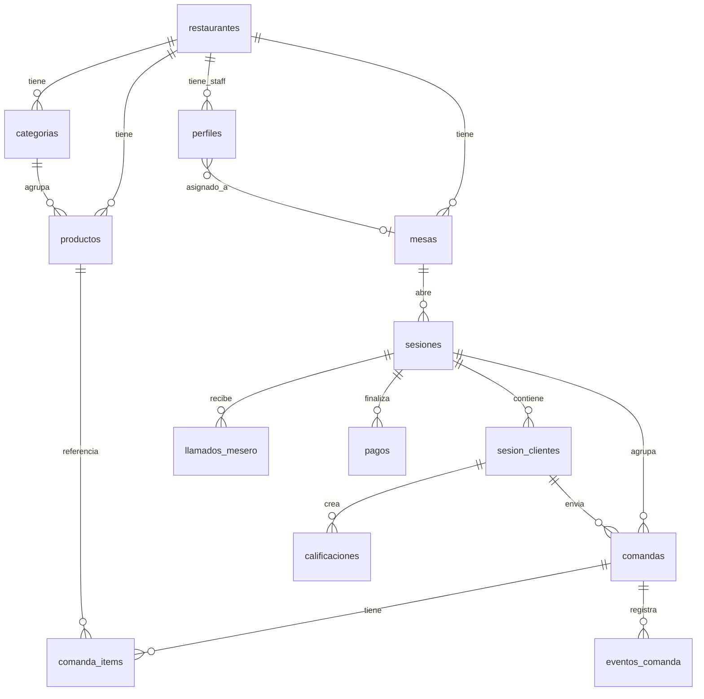
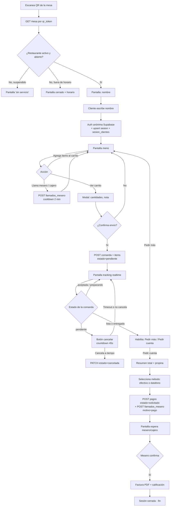
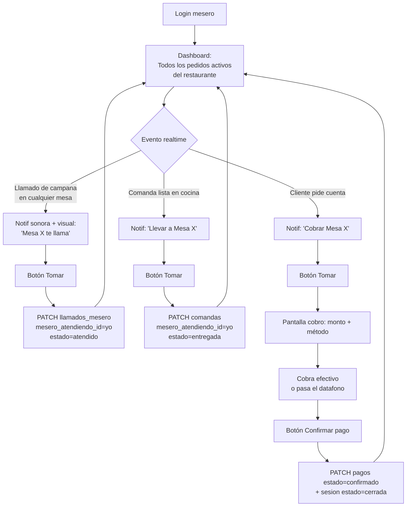
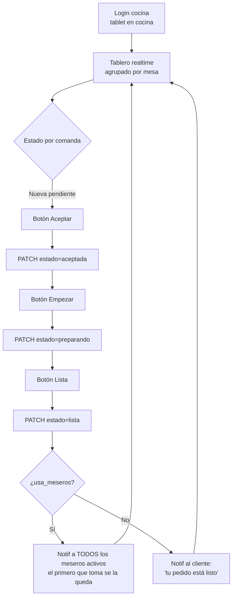
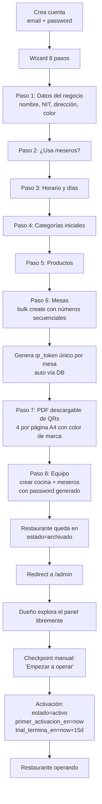

# MesaYA — Documento Maestro del Proyecto

**Versión:** 0.4 · **Fecha:** 2 may 2026 · **Estado:** Producto end-to-end funcional. Onboarding completo + panel del dueño con activación + app cliente con 5 estados validados. Listo para apps de cocina y mesero (S4).

> **Cómo usar este documento:** Pégalo al inicio de cada chat con Claude para que arranque con todo el contexto. Después de cada sesión, agrega entrada en la **Bitácora** (sección 14) y sube versión menor (v0.4 → v0.5).

**Cambios desde v0.3 (S2.2 + S2.3 + S3):**
- **S3:** Migration `primer_activacion_en` aplicada. Panel del dueño con banner contextual de estado (archivado/activo/trial≤3días/suspendido). Action "Empezar a operar" arranca trial. App cliente `apps/cliente` con 5 estados validados visualmente (activo placeholder / archivado / cerrado por horario / mesa inactiva / token inválido).
- **Modelo "free pickup" para meseros:** sin asignación de mesa↔mesero. Cualquier mesero ve todos los pedidos del restaurante y los toma en runtime. Reescribe secciones 3, 7, 9.
- **Trial NO arranca al cerrar wizard:** el restaurante queda en `archivado` post-onboarding. El dueño explora el panel, y cuando esté listo activa desde checkpoint "Empezar a operar". Reescribe sección 9.
- **Cuentas de equipo con password generado en pantalla** (en vez de invite por email). Botón "Copiar mensaje" para WhatsApp.
- **Tabla `pedidos_qr` postergada** hasta que se monte el servicio físico de impresión (semana 4-5).
- Schema verificado contra DB real: nuevas columnas `restaurantes.dueno_user_id` + `primer_activacion_en`, `perfiles.nombre` (no `nombre_completo`), sufijos `creado_en`/`actualizada_en` mixtos por tabla.

**Cambios desde v0.1:** Nombre confirmado (`MesaYA`). QRs como servicio de impresión laminada + PDF temporal. Cliente flow simplificado (escaneo → nombre → menú, sin elección de modo). Demo de 15 días + suspensión. Todas las decisiones pendientes resueltas excepto modelo de precios.

---

## 1. ¿Qué es MesaYA?

Sistema web para restaurantes en Colombia (foco inicial: Bogotá) que permite al cliente pedir, hacer adiciones, llamar al mesero y pagar desde su celular escaneando un QR en la mesa, sin esperar a que un mesero venga a tomarle el pedido.

**Problema que resuelve:**
- Cliente: tiempo perdido esperando que el mesero venga, repita la orden, traiga la cuenta.
- Mesero: caos de comandas verbales, errores, presión de mesas en paralelo.
- Dueño: dependencia del mesero como bottleneck, errores de cobro, cero datos.

**Propuesta de valor:**
- Cliente: pedir en 30 segundos, sin esperar a nadie.
- Restaurante: rotar mesas más rápido, menos errores de comanda, datos en tiempo real.

**Modelo de negocio:** SaaS por suscripción mensual. Demo gratis de 15 días, sin pasarela de pago en MVP, sin comisión por transacción.

---

## 2. Alcance del MVP (v1)

### ✅ Incluido en v1

- App cliente (web/PWA) modo solo — escanea QR, da nombre, pide, paga.
- App mesero (web) — login, mesas asignadas, llamados, marcar entregas, confirmar pagos.
- Tablero de cocina — comandas tiempo real, cambio de estados, sonido de notificación.
- Dashboard del dueño — onboarding, gestión de menú, mesas, meseros, KPIs básicos.
- Pagos: efectivo y datafono manuales. Cliente indica método, mesero confirma recibido.
- Multi-tenant con flag `usa_meseros` por restaurante (cafés sin meseros vs casuales con meseros).
- Servicio de impresión y envío de QRs laminados + PDF temporal mientras llegan.
- Idioma único: español.

### ❌ Explícitamente fuera (v2 o más)

- Modo grupal con PIN.
- Integración con pasarelas de pago (Wompi, Bold, PSE).
- Multi-idioma del cliente y dashboard.
- Métricas avanzadas (cohorts, predicciones, análisis de productos).
- Reportes exportables (Excel, PDF de cierre de caja).
- Modificadores de productos (sin cebolla, término, tamaño). En v1 solo nota libre del cliente.
- Inventario / control de stock.
- Programa de fidelidad / puntos / cupones.
- Integración con POS existentes.
- Impresoras térmicas de cocina (cocina ve en tablet/pantalla).
- App nativa iOS/Android (todo es web/PWA).
- Historial de cambios de mesero por sesión.

### Decisiones cerradas

| Decisión | Elegimos | Por qué |
|---|---|---|
| Tipo de restaurante en MVP | Ambos (cafés y casuales) | Manejo con flag `usa_meseros`. |
| Rol del mesero | App propia con mesas asignadas | UX correcta para casuales; en cafés se desactiva. |
| Pagos en v1 | Manuales (sin pasarela) | Elimina riesgo regulatorio (SFC) y semanas de integración. |
| Carga de menú | Dueño self-service desde dashboard | Escala sin intervención manual. |
| Modo grupal | Pospuesto a v2 | Validar modo solo primero. |
| Nombre del producto | `MesaYA` | Decidido. |
| QRs físicos | Servicio de impresión laminada + envío. PDF temporal. | Premium feel, justifica precio. |
| Cliente sin cuenta visible | Auth anónima por debajo, UX sin mostrar "cuenta" | Fricción cero al escanear. |
| Demo / trial | 15 días gratis, después suspensión hasta pago | Sin plan free permanente. |
| Cambio de mesero a media sesión | Pasa al nuevo desde ese instante | Snapshot al cierre con mesero activo. |

---

## 3. Actores y roles

| Actor | Auth | Identidad | Permisos |
|---|---|---|---|
| **Cliente** | Anónima (Supabase anonymous auth, transparente para él) | `auth.uid()` anónimo + nombre que escribe | Lee su mesa/sesión/comandas, escribe comandas y llamados de su sesión |
| **Mesero** | Email + password | `auth.uid()` + `perfiles.rol = 'mesero'` | Lee/escribe **todas las** mesas, llamados, comandas y pagos del restaurante. Modelo "free pickup": toma comandas en runtime, no por preasignación. |
| **Cocina** | Email + password (cuenta compartida en tablet) | `auth.uid()` + `perfiles.rol = 'cocina'` | Lee comandas del restaurante, cambia estados |
| **Dueño/Admin** | Email + password | `auth.uid()` + `perfiles.rol = 'dueno'` | Todo en su restaurante |

**Decisión sobre modelo de meseros (S2.3):** los meseros no se preasignan a mesas. Cualquier mesero activo ve todos los pedidos del restaurante y "toma" comandas/llamados en runtime con un campo `comanda.mesero_atendiendo_id` (a implementar en S4). La columna `mesas.mesero_asignado_id` queda en el schema pero sin uso (limpieza pendiente).

---

## 4. Configuración por restaurante

En `restaurantes`:
- `id: uuid` — PK.
- `dueno_user_id: uuid NOT NULL` — FK a `auth.users`. Relación directa además de la vía `perfiles.restaurante_id`.
- `nombre_publico: text NOT NULL`.
- `nit: text NULL`.
- `direccion: text NULL`.
- `usa_meseros: bool` (default `true`) — si `false`, los llamados van a la vista de cocina/cajero.
- `horario_apertura: time` (default `08:00:00`).
- `horario_cierre: time` (default `22:00:00`).
- `dias_operacion: text[]` (default todos los días).
- `timezone: text` (default `America/Bogota`).
- `color_marca: text` (default `#4a7c59`) — hex para personalización.
- `estado: text` — `activo`, `suspendido`, `archivado`. Default `activo` en DB pero el wizard del onboarding crea con `archivado`.
- `trial_termina_en: timestamptz` — fecha hasta la cual el trial es gratis. **PENDIENTE migration:** debería ser NULL hasta primera activación; hoy tiene default `now() + 15 days` lo cual es incorrecto con el nuevo modelo.
- `creado_en: timestamptz`, `actualizada_en: timestamptz` (femenino, distinto de `perfiles`).

**PENDIENTE migration (S2.4):** agregar columna `primer_activacion_en: timestamptz NULL` para registrar la primera vez que el dueño hizo checkpoint "Empezar a operar".

---

## 5. Modelo de datos

### Diagrama ER



Las definiciones SQL completas están en `migrations/001_initial_schema.sql`. Resumen rápido de tablas:

| Tabla | Propósito |
|---|---|
| `restaurantes` | Tenant raíz. Configuración del negocio. |
| `perfiles` | Staff (dueño, mesero, cocina). 1:1 con `auth.users`. Campo principal: `nombre` (no `nombre_completo` como decía v0.2). Sufijos: `creado_en`/`actualizado_en` (masculino). |
| `mesas` | Mesas físicas con QR único. Columna `mesero_asignado_id` quedó como legacy del modelo anterior — **no usar**, modelo "free pickup" la ignora. Numero es `text` (no integer). |
| `categorias` | Categorías del menú. |
| `productos` | Items del menú. Precio en pesos enteros (no centavos). |
| `sesiones` | Una mesa abierta. Vive desde primer escaneo hasta pago/cierre. |
| `sesion_clientes` | Cada cliente que escaneó esa mesa en esa sesión. |
| `comandas` | Cada "envío a cocina". Una sesión puede tener varias comandas (cliente pide más). En S4 se agrega `mesero_atendiendo_id uuid NULL` para el modelo free pickup. |
| `comanda_items` | Items de cada comanda (con snapshot de nombre y precio). |
| `eventos_comanda` | Audit log de cambios de estado. |
| `llamados_mesero` | Botón campana / pago / otro. |
| `pagos` | Solicitud de pago + confirmación del mesero/cajero. |
| `calificaciones` | 1-5 estrellas + comentario opcional. |

### Reglas de negocio del esquema

- Solo puede haber 1 sesión `abierta` o `pago_pendiente` por mesa a la vez (constraint).
- `numero_diario` de comanda se resetea cada día por restaurante (edge function a las 4am).
- Al borrar una comanda: cascada a `comanda_items` y `eventos_comanda`.
- `precio_snapshot` y `nombre_snapshot` se capturan al crear comanda_item (si el dueño cambia el precio después, las comandas viejas no se afectan).
- `eventos_comanda` no se borra nunca (audit).
- Soft delete: usamos `activa: bool` en mesas, categorías, productos. Hard delete solo en items que el dueño pueda querer remover.

### Row Level Security (RLS)

Activa en TODA tabla. Políticas detalladas en `migrations/002_rls_policies.sql`. Resumen:

- **Staff:** lee/escribe registros donde `restaurante_id` coincide con su `perfiles.restaurante_id`.
- **Cliente anónimo:** lee/escribe registros donde es miembro vía `sesion_clientes.auth_user_id = auth.uid()`.
- **Acceso público (sin auth):** lectura de `restaurantes`, `mesas` (por `qr_token`), `productos`, `categorias`. Necesario para que el QR sea escaneable antes de abrir sesión.
- **Cocina:** no crea comandas, solo cambia estados.
- **Mesero:** no crea comandas, solo cambia estado a `entregada` y confirma `pagos`.
- **Dueño:** todo en su restaurante.

---

## 6. Diagrama de flujo: Cliente



**Detalles importantes:**
- Si el cliente cierra el navegador, vuelve a escanear el QR y retoma su sesión (auth anon persiste en cookies).
- Cancelación solo válida en estado `pendiente`. Una vez cocina marca `aceptada`, ya no se cancela.
- En cafés sin meseros, los llamados llegan al tablero de cocina/cajero.

---

## 7. Diagrama de flujo: Mesero (modelo "free pickup")



**Detalles importantes (S2.3):**
- Cualquier mesero ve TODOS los llamados/comandas/pagos del restaurante. No hay filtro por "mis mesas".
- Lock optimista al "Tomar": si dos meseros click al mismo tiempo, gana el primero. El segundo recibe error y la tarea desaparece de su lista.
- Mesero puede "soltar" una tarea si no puede ir (cambia `mesero_atendiendo_id` a NULL, vuelve al pool).
- En cafés sin meseros (`usa_meseros=false`), los llamados van a la vista de cocina/cajero. Cocina hace el rol de tomador.

---

## 8. Diagrama de flujo: Cocina



Comandas con más de 15 min en estado `aceptada` o `preparando` se ven en rojo (visual). Sonido al llegar nueva (configurable).

---

## 9. Diagrama de flujo: Onboarding del dueño



**Cambios desde v0.2 (registrados en S2.3):**

1. **El wizard ya no activa el restaurante.** Termina con `estado=archivado`. El dueño explora `/admin` con datos cargados pero sin abrirse al público. Mientras esté archivado, los QRs en producción muestran "Este restaurante aún no abrió".

2. **El trial de 15 días arranca en el checkpoint, no al cerrar wizard.** Esto protege al dueño de "quemar" días mientras perfecciona el menú o entrena al equipo.

3. **No hay paso de "asignar meseros a mesas"** (era el paso 9 viejo). Modelo "free pickup" lo elimina. Las cuentas de mesero se crean en paso 8 sin asignación.

4. **Cuentas de equipo con credenciales en pantalla** (no por email): se genera password temporal de 10 caracteres legibles. Botón "Copiar mensaje" arma texto listo para WhatsApp.

5. **Solo el dueño puede entrar a `/admin`.** Si una cuenta de mesero/cocina intenta acceder, redirect a `/login?error=acceso-denegado`. Las apps de staff (mesero, cocina) viven en otros subdominios — se construyen en S4.

**Requisitos del checkpoint "Empezar a operar" (a construir en S3):**
- Mínimo 1 categoría, 1 producto, 1 mesa, 1 cuenta de cocina, datos del negocio completos.
- El wizard ya garantiza estos mínimos para llegar al final, así que el checkpoint es básicamente un "OK, ¿listo?".

**QRs físicos (servicio):**
- Pendiente: tabla `pedidos_qr` se crea cuando se monte el servicio físico de impresión laminada (semana 4-5 estimadas).
- Por ahora, paso 7 entrega solo PDF descargable.
- Plazo objetivo: 3-5 días hábiles. Costo: incluido en setup o aparte (decisión pendiente, sección 13).

**Trial de 15 días:**
- Empieza al hacer checkpoint "Empezar a operar".
- Día 12: email "te quedan 3 días".
- Día 15 23:59: si no pagó, `restaurantes.estado` pasa a `suspendido`.
- Suspendido: clientes ven "Restaurante temporalmente sin servicio" al escanear. Dashboard del dueño sigue accesible para pagar y reactivar.

---

## 10. Stack técnico

### Frontend
- **Next.js 15+ (App Router)** — monorepo con tres apps por subdominios.
- **TypeScript** estricto.
- **Tailwind CSS v4 + shadcn/ui** para staff y dashboard. Cliente con CSS más custom para sentirse marca del restaurante.
- **Zustand** para estado client-side (carrito, sesión).
- **TanStack Query** para fetching/caching.
- **Zod** para validación.
- **PWA** instalable.

### Backend
- **Supabase**:
  - Postgres + RLS.
  - Auth (anónima para clientes, email/password para staff).
  - Realtime sobre `comandas`, `llamados_mesero`, `pagos`.
  - Storage para fotos de productos y PDFs.
  - Edge Functions (Deno) para: generar QRs, generar PDF de factura, cerrar sesiones expiradas, resetear `numero_diario` a medianoche, suspender restaurantes con trial vencido.

### Infra
- **Vercel** (Next.js).
- **Sentry** para errores en producción.
- **Plausible** para analytics.

### URLs (subdominios decisión S2.1)
- `mesaya.co` — landing.
- `admin.mesaya.co` — dashboard dueño.
- `staff.mesaya.co` — login y app de mesero/cocina.
- `m.mesaya.co/{qr_token}` — entrada del cliente.

**Decisión sobre subdominios vs paths:** elegimos subdominios porque (a) el QR del cliente es la cara del producto, un bug en admin no debe tirar la experiencia del comensal; (b) cookies y bundles separados; (c) deploys independientes en Vercel.

**En desarrollo local:**
- `admin`: `localhost:3000`
- `staff`: `localhost:3001`
- `cliente`: `localhost:3002`
- Para tests con QR desde celular en LAN: env var `NEXT_PUBLIC_APP_URL_CLIENTE=http://<IP-LAN>:3002`

### Convenciones
- Código (variables, funciones): inglés.
- Tablas y columnas DB: español (dominio del negocio).
- UI: español.
- DB: `snake_case`. JS: `camelCase`. URLs: `kebab-case`.
- Commits: Conventional Commits.

---

## 11. Plan semana a semana

| Semana | Objetivo | Entregable |
|---|---|---|
| **1 (cerrada)** | Definición y diagramas | Doc maestro v0.2, esquema SQL, RLS. |
| **2 (cerrada)** | Setup + auth + onboarding completo | Repo, monorepo, Supabase aplicado, login dueño, wizard 8/8 pasos, generación QR, PDF descargable. |
| **3 (parcial cerrada)** | Panel del dueño + checkpoint de activación + app cliente con estados | Dashboard real con métricas básicas, "Empezar a operar" arranca trial, cliente lee QR y muestra estado. **CRUD post-onboarding del menú/mesas/equipo postergado a S4 o S5.** |
| **4** | Apps de cocina y mesero + flujo cliente completo | Cocina: tablero realtime, estados. Mesero: free pickup. Cliente: nombre → menú → carrito → comanda. |
| **5** | KPIs + cierre + demo-ready | KPIs avanzados. Modo simulación. Seed data. CRUD post-onboarding. Pulida visual. |

**Criterios demo-ready (final S5):**
- Onboarding del dueño impecable, sin pantallas en blanco, mensajes claros.
- Pantalla cliente se siente "del restaurante" (color, nombre, branding mínimo).
- Modo simulación para hacer demo en pantalla dividida (cliente + cocina + mesero).
- Seed data realista de un restaurante demo precargado.
- Cero estados de error visibles en flujo feliz.

---

## 12. Convenciones de trabajo con Claude

- **Doc maestro:** tú lo mantienes, yo no recuerdo entre chats.
- **Inicio de cada chat:** "Soy [nombre]. Te paso doc maestro v0.X. Hoy quiero [objetivo concreto]."
- **Un chat = un objetivo.** No mezclar.
- **Sesión >40 turnos:** abrir chat nuevo con el doc + resumen de lo último.
- **Bitácora:** se actualiza al final de cada sesión.
- **Tareas para Claude:** diseño, código, debug, tests, docs.
- **Tareas para ti:** despliegues, decisiones de producto, hablar con clientes, conexiones a servicios externos.

---

## 13. Decisiones pendientes

| # | Pregunta | Estado |
|---|---|---|
| 1 | Precio de la suscripción mensual | Definir tras 1-2 pilotos cobrando |
| 2 | Cobro del servicio de QRs laminados (incluido en setup o aparte) | Definir antes de tener primer cliente pagando |
| 3 | Costo del envío de QRs (incluido o calculado por ciudad) | Definir antes del primer cliente |
| 4 | Vinculación de cuenta `auth.users` existente a perfil de mesero en otro restaurante | v2: hoy MVP requiere correo único globalmente |
| 5 | Recovery del bug de tipos genéricos Supabase (cliente sin `<Database>`) | Cleanup post-MVP. Hoy queries con `data: any`, type safety por campo a campo cuando importa. |
| 6 | Limpieza de columna `mesas.mesero_asignado_id` (legacy del modelo viejo) | Migration en S2.4 o cuando estabilice el schema |

---

## 14. Bitácora de sesiones

### Sesión 2.1 — 30 abr 2026 (noche)

**Objetivo:** Scaffold del monorepo Next.js + conexión a Supabase + primera pantalla del onboarding del dueño.

**Decisiones tomadas:**
- Arquitectura: 3 apps Next separadas (admin/staff/cliente) en monorepo pnpm + Turborepo. Cada app deploya a su propio proyecto Vercel.
- Tailwind v4 CSS-first con tokens compartidos en `@mesaya/config/tailwind/tokens.css`.
- Identidad visual: papel cálido (#FAF6F1) + tinta (#1A1814) + acento terracota (#C0432E). Fuentes: Fraunces (display) + Geist (UI).
- Perfil del dueño se crea en paso-1 del onboarding (no en signup) por constraint `perfiles.restaurante_id NOT NULL`.
- Restaurante nace en `estado='archivado'`, pasa a `'activo'` al completar wizard.
- Service client (Supabase service_role) usado para crear restaurante + perfil en una operación atómica desde server action.
- En dev: `Confirm email` desactivado en Supabase. En prod se vuelve a prender.

**Bugs detectados contra el doc v0.2 (corregidos):**
- `perfiles.nombre_completo` → en realidad se llama `perfiles.nombre`.
- `restaurantes` tiene columna `dueno_user_id uuid NOT NULL` que el doc no listaba — corresponde a la relación con auth.users (mejor que solo vía `perfiles.restaurante_id`).
- Sufijo `_en` para timestamps cambia entre tablas: `creado_en`/`actualizado_en` en perfiles, `creado_en`/`actualizada_en` en restaurantes (femenino). Mantener al regenerar tipos.

**Entregables:**
- Repo `raikflex/mesaya` scaffolded en GitHub. 73 archivos, lockfile commiteado.
- Stack instalado: Next 15.5.15, React 19, Tailwind 4, Supabase 2.45 + ssr 0.5, Zod, Turborepo 2.9.
- Flujo end-to-end probado contra DB real: signup → paso-1 → restaurante creado → perfil creado → redirect a paso-2.
- Pantalla del paso-1 con preview en vivo del color de marca + paleta curada de 8 colores.

**Decisiones pendientes a resolver antes de S2.2:**
- (#) Subdominios (admin.mesaya.co/staff.mesaya.co/m.mesaya.co) vs path-based (app.mesaya.co/admin, /staff, /m). Recomendación: subdominios para mejor separación cookies/bundles.

**Estado del repo al cerrar:**
- `main` branch limpio, todo en GitHub. Commit `d2c041c`.
- `pnpm dev:admin` levanta el server en localhost:3000 contra Supabase prod.

---

### Sesión 2.2 — 1 may 2026

**Objetivo:** Login/logout, stepper, pasos 2-4 del onboarding (meseros, horario, categorías).

**Decisiones tomadas:**
- Subdominios confirmados (decisión #) — `admin.mesaya.co`, `staff.mesaya.co`, `m.mesaya.co`.
- No usar shadcn CLI: primitives propios en `@mesaya/ui` con tokens compartidos.
- Stepper como Client Component con `usePathname` para detectar paso actual.
- Cliente Supabase **sin genérico `<Database>`** por bug de propagación cross-workspace que perdió 2+ horas. Trade-off aceptado, type safety por campo a campo cuando importa (ver decisión pendiente #5).

**Bloqueador severo del día:**
- El portapapeles de Windows (causa probable: PowerToys Advanced Paste o extensión de navegador) convertía patrones tipo `process.env.NEXT_*` en autolinks Markdown corruptos al pegar código. Resultado: 98 archivos del repo corrompidos en cascada. Rama `sesion-2.2-wip` quedó como respaldo del daño. Workaround durante la sesión: usar sintaxis `(globalThis as any).process?.env?.['NEXT_PUBLIC_...']` con corchetes que no matchea el patrón problemático.
- Felipe identificó la app responsable y la desactivó al final del día. Confirmado clean en S2.3.

**Bug secundario:**
- Tipos genéricos de Supabase 2.105 no propagaban correctamente cross-workspace, causando cascada `never` en los apps. Solución temporal: cliente sin genérico `<Database>`. Tipos generados con `npx supabase gen types` y disponibles para uso manual en queries específicas.

**Entregables:**
- Login + signup + logout funcionales contra Supabase Auth.
- Layout `/admin` que verifica sesión.
- Stepper vivo con detección de URL.
- Paso 2: toggle "¿Usas meseros?" con dos cards visuales.
- Paso 3: horario + 7 toggles de días + 3 presets (Lun-Vie/Lun-Sáb/Todos).
- Paso 4: CRUD de categorías (agregar, renombrar inline, reordenar arriba/abajo, soft delete).
- Tipos Supabase generados con CLI y disponibles para importar (`@mesaya/database/types`).

**Estado del repo al cerrar:**
- `main` con commit `e35f30f`. Working tree clean.

---

### Sesión 2.3 — 2 may 2026

**Objetivo:** Pasos 5, 6, 7, 8 del onboarding. Cerrar el wizard completo.

**Decisiones tomadas (cambian el modelo del producto):**

1. **Modelo "free pickup" para meseros (sección 3, 7, 9 del doc reescritas):**
   - Meseros NO se asignan a mesas específicas en el setup.
   - Cualquier mesero activo ve TODOS los pedidos del restaurante en su app.
   - Toman comandas/llamados/pagos en runtime con un campo `comanda.mesero_atendiendo_id` (a implementar en S4).
   - Lock optimista: si dos meseros click al mismo tiempo, gana el primero.
   - Razón: más realista para restaurantes en Bogotá donde el mesero rota y no tiene "su" mesa fija.
   - Consecuencia: columna `mesas.mesero_asignado_id` queda como legacy (limpieza pendiente).

2. **Trial NO arranca al cerrar wizard (sección 9 reescrita):**
   - Restaurante queda en `estado='archivado'` después del onboarding.
   - El dueño explora `/admin` libremente con datos cargados.
   - Cuando esté listo, hace checkpoint manual "Empezar a operar" desde el panel.
   - Ahí se activa `estado='activo'` y arranca trial de 15 días.
   - Razón: protege al dueño de quemar días mientras perfecciona el menú.
   - Consecuencia: pendiente migration para `primer_activacion_en TIMESTAMPTZ NULL` y arreglar default de `trial_termina_en`.

3. **Cuentas de equipo con password generado en pantalla** (no por email):
   - 10 caracteres legibles sin caracteres ambiguos (`l`, `1`, `0`, `o`).
   - Botón "Copiar mensaje para enviar" copia texto listo para WhatsApp.
   - v2 pendiente: invitación por correo electrónico con link de "establecer contraseña".

4. **Tabla `pedidos_qr` postergada:** se crea cuando se monte el servicio físico de impresión laminada (semana 4-5). Hoy solo PDF temporal.

5. **Layout `/admin` protegido solo para dueños:** meseros y cocina que intenten entrar son redirigidos a `/login?error=acceso-denegado`. En S4 se redirigen a sus apps respectivas.

**Entregables:**
- Paso 5: CRUD de productos básico (nombre, precio en pesos, categoría dropdown, descripción opcional). Agrupación visual por categoría. Validación con Zod.
- Paso 6: Bulk create de mesas con números secuenciales (1, 2, 3…). Edición inline de capacidad. Borrado individual. Soporta agregar más mesas después.
- Paso 7: PDF descargable A4 con grid 2x2 de QRs. Cada QR apunta a `${NEXT_PUBLIC_APP_URL_CLIENTE}/m/{qr_token}` (env var con fallback a localhost). Color de marca del restaurante en el texto "Mesa N". Probado escaneando con celular en LAN.
- Paso 8: Crear cuentas de cocina y meseros. Tarjeta de credenciales con botón copiar para WhatsApp. Lista del equipo agrupada por rol. Cierre del wizard redirige a `/admin` sin activar restaurante.
- Layout `/admin` protege contra accesos no-dueño.
- Dependencias añadidas: `pdf-lib`, `qrcode`, `@types/qrcode`.

**Bugs/edge cases conocidos:**
- Si un correo ya tiene cuenta, no se puede crear otra con el mismo correo (correcto para MVP de un restaurante por persona).
- Modelo "free pickup" solo está reflejado en el wizard. La app del mesero (S4) tiene que respetar el nuevo modelo.

**Estado del repo al cerrar:**
- `main` con commit `6b7fc70` (paso 7 + 8 + protección /admin). Working tree limpio. Pendiente push del cliente para arrancar S3.

---

### Sesión 3 — 2 may 2026 (noche)

**Objetivo:** Panel real del dueño con checkpoint de activación + app cliente con pantallas de estado.

**Migration aplicada en Supabase:**
```sql
ALTER TABLE restaurantes ADD COLUMN primer_activacion_en TIMESTAMPTZ NULL;
ALTER TABLE restaurantes ALTER COLUMN trial_termina_en DROP DEFAULT;
ALTER TABLE restaurantes ALTER COLUMN trial_termina_en DROP NOT NULL;
UPDATE restaurantes SET trial_termina_en = NULL WHERE estado='archivado' AND primer_activacion_en IS NULL;
```

**Decisiones tomadas:**
- App cliente vive en `apps/cliente`, ruta `/m/[token]`. URL en producción será `m.mesaya.co/{qr_token}`.
- 5 estados visuales del cliente: activo (placeholder de menú), archivado, suspendido, mesa-inactiva, fuera-de-horario, token-inválido (404).
- Cálculo de horario usa `Intl.DateTimeFormat` con `timeZone='America/Bogota'` para detectar día y hora actuales en TZ correcta. Soporta caso "trasnoche" (apertura > cierre, ej. 18:00 - 02:00).
- `primer_activacion_en` solo se setea la PRIMERA vez. Reactivaciones futuras (cuando el dueño vuelva a abrir tras suspensión) no lo sobrescriben.
- El banner del panel cambia visual según estado y días de trial restantes (verde normal, amarillo si ≤3 días, rojo si suspendido).

**Bugs resueltos:**
- App cliente sin `.env.local` heredado del scaffold inicial. Solución: copiar de admin.
- Conflicto de slugs entre `[qr_token]` (carpeta vieja del scaffold) y `[token]` (nueva). Borrada la vieja desde el Explorador de Windows porque PowerShell con corchetes no la podía resolver.
- JOIN de Supabase devuelve siempre array aunque sea 1:1. Usar `Array.isArray(...) ? [0] : ...` para acceder al objeto único.

**Tests visuales validados con screenshot:**
- ✅ Activo: card "Tu menú está casi listo" con icono de menú en color de marca
- ✅ Archivado: card "Aún no abrimos" con reloj
- ✅ Cerrado: card "Estamos cerrados ahora · Abre hoy a las 23:00" con luna
- ✅ Mesa inactiva: card "Esta mesa no está disponible" con triángulo de alerta
- ✅ Token inválido: card "Código no reconocido" sin info de mesa
- ✅ Activación end-to-end: estado=archivado → click "Empezar a operar" → estado=activo + primer_activacion_en seteado + trial_termina_en = now+15d (todo verificado en SQL).

**Entregables:**
- `apps/admin/app/admin/page.tsx`: panel real con saludo + nombre del negocio + banner contextual + stats + sección "Próximamente"
- `apps/admin/app/admin/banner-activacion.tsx`: 4 variantes visuales según estado
- `apps/admin/app/admin/banner-bienvenida.tsx`: aparece tras activación, autocierra 6s
- `apps/admin/app/admin/actions/empezar-a-operar.ts`: action de activación con validación de mínimos como defensa en profundidad
- `apps/cliente/app/m/[token]/page.tsx`: lee mesa + restaurante, decide estado, calcula próxima apertura en TZ correcta
- `apps/cliente/app/m/[token]/estado-restaurante.tsx`: 5 variantes visuales con icono en color de marca
- `apps/cliente/app/m/[token]/not-found.tsx`: pantalla 404 amable
- Limpieza: rama `sesion-2.2-wip` borrada (local + remoto), `check.txt` borrado, scaffold viejo `[qr_token]` borrado.

**Pendiente para S4:**
- Migration: agregar `mesero_atendiendo_id uuid NULL` a `comandas` y `llamados_mesero` (para modelo free pickup).
- App cocina (`apps/staff` con detección de rol cocina): tablero realtime de comandas, sonido al llegar nueva, cambio de estados.
- App mesero (mismo `apps/staff`, rol mesero): lista de comandas/llamados/pagos del restaurante con botón "Tomar". Lock optimista en server action.
- Flujo cliente completo: del placeholder al menú real → carrito en Zustand → enviar comanda → tracking.
- Auth anónima de Supabase para clientes.
- Realtime sobre `comandas` y `llamados_mesero`.
- Seed data de demo (1 restaurante con menú completo, 5 mesas, 1 cocina, 2 meseros).

**Estado del repo al cerrar S3:**
- `main` con dos commits nuevos: `6b7fc70` (panel + activación) y el commit del cliente (pendiente de push final).
- 5/5 typecheck verde.
- Producto end-to-end funcional: signup → onboarding → panel → activar → cliente escanea QR → ve estado correcto.

---

**Fin del documento maestro v0.4.**
